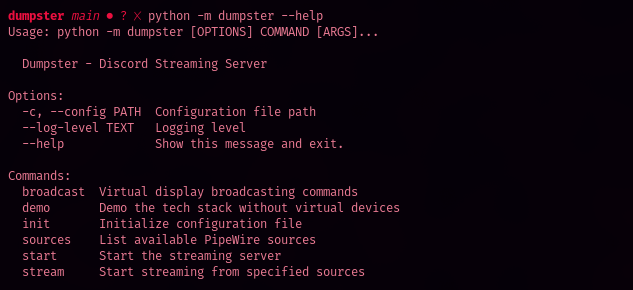

    

        
        <h1 class="name">sefra</h1>
    

    
    

        

            hi! i build free open source software that helps artists and other ne'er-do-wells be creative with LLMs without losing their soul. i don't charge for services, but i do accept tips!
        

        <a href="https://ko-fi.com/sefra" class="kofi-button" target="_blank">
            tip me on ko-fi!
        </a>
    

    

        

            
            

                <h3 class="project-title">rakun</h3>
                
my flagship creation, rakun, is a discord chatbot with advanced memory features and an adorably shitty attitude. open source release: TBA

            

        

        
        

            
            

                <h3 class="project-title">dumpster</h3>
                
a bespoke headless wayland audiovisual streaming system for TV-like broadcasts via discord. open source release: late nov 2025

            

        

        
        

            
            

                <h3 class="project-title">top secret trainer project</h3>
                
local LLM training for artists and anyone else who doesn't gaf what gradient descent means. open source release: mid 2026

            

        

    

    
    <button class="carousel-nav carousel-prev">‹</button>
    <button class="carousel-nav carousel-next">›</button>
    
    

        
        
        
    

